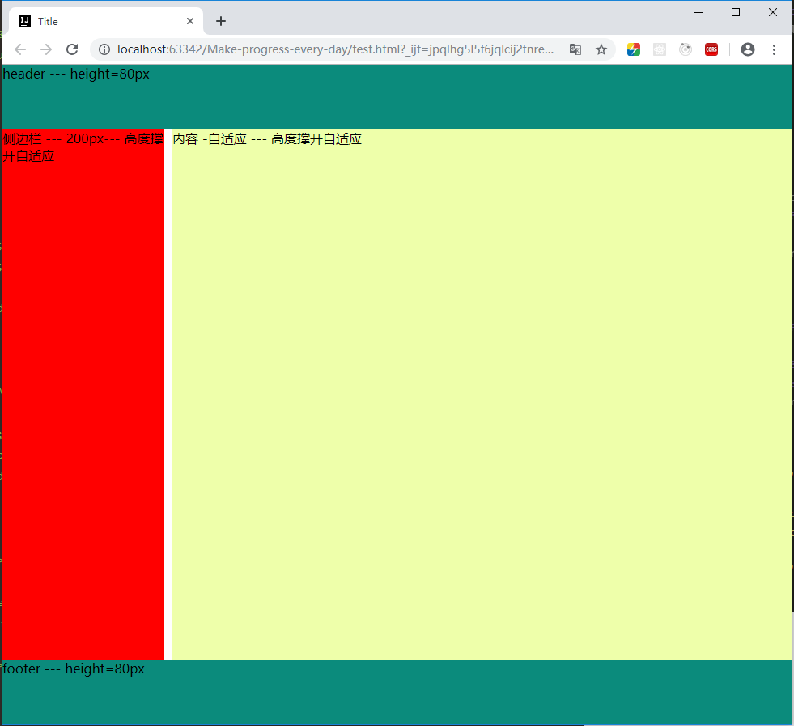

### 布局设计

``` 
<style type="text/css">
    * {
        margin: 0;
        padding: 0;
    }
    #header{
        width: 100%;
        height: 80px;
        background: #0b8b7c;
        position: absolute;
        top: 0;
        left: 0;
    }
    #footer{
        width: 100%;
        height: 80px;
        background: #0b8b7c;
        position: absolute;
        bottom: 0;
        left: 0;
    }
    #wrapper{
        display: flex;
    }
    #aside{
        width: 200px;
        background: red;
        padding: 80px 0;
        height: 100vh;
        box-sizing: border-box;
    }
    #content{
        flex: 1;
        background: #EFA;
        height: 100vh;
        padding: 80px 0;
        margin-left: 10px;
        box-sizing: border-box;
    }
</style>
<body>
	<header id="header">header --- height=80px</header>
	<div id="wrapper">
	    <aside id="aside">侧边栏 --- 200px--- 高度撑开自适应</aside>
	    <section id="content">内容 -自适应 --- 高度撑开自适应</section>
	</div>
	<footer id="footer">footer --- height=80px</footer>
</body>
```

