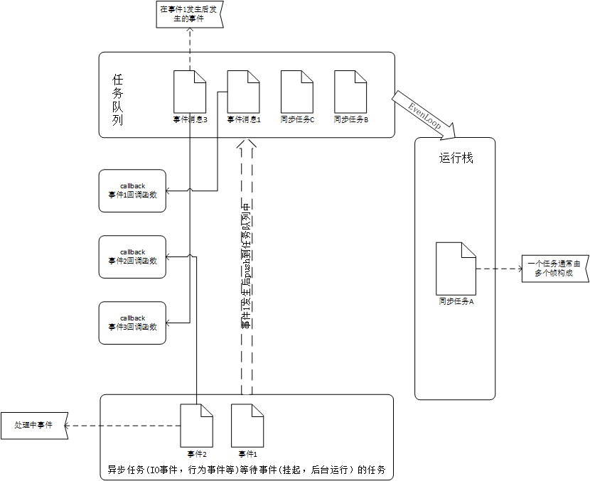

##JS 运行机制
   JS 执行是单线程的，它是基于事件循环的。
   >PS:虽然JavaScript是单线程，但浏览器是多线程的，例如Webkit或是Gecko引擎，可能有javascript引擎线程、界面渲染线程、浏览器事件触发线程、Http请求线程，读写文件的线程
###如何理解JS单线程？
   一句话讲：一个时间内，JS只能干一件事。
### 什么是任务队列？
分同步任务与异步任务。
执行顺序：先执行同步任务，异步任务会先挂起。
异步任务的放入时间与执行时间：浏览器有个timer模块，主要处理setTimeout,setInterval(),当定时器到了时间才会放入异步队列中，然后等待事件循环执行。
> setTimeout和setInterval的延时最小间隔是4ms（W3C在HTML标准中规定）；在JavaScript中没有任何代码是立刻执行的，但一旦进程空闲就尽快执行。这意味着无论是setTimeout还是setInterval，所设置的时间都只是`n毫秒被添加到队列中`，而`不是过n毫秒后立即执行`。

### 什么是 Event Loop？
* 所有同步任务都在主线程上执行，形成一个执行栈（execution context stack）。
* 主线程之外，还存在一个"任务队列"（task queue）。只要异步任务有了运行结果，就在"任务队列"之中放置一个事件。
* 一旦"执行栈"中的所有同步任务执行完毕，系统就会读取"任务队列"，看看里面有哪些事件。那些对应的异步任务，于是结束等待状态，进入执行栈，开始执行。
* 主线程不断重复上面的第三步。

大白话讲：主线程（js线程）只会做一件事，就是从任务队列里面取消息、执行消息，再取消息、再执行。如果任务队列为空时，就会等待，直到任务队列变成非空。只有当前的消息执行结束，才会去取下一个消息。这种机制就叫做事件循环机制Event Loop，取一个消息并执行的过程叫做一次循环。
主线程（js线程）只会做一件事，就是从任务队列里面取消息、执行消息，再取消息、再执行。如果任务队列为空时，就会等待，直到任务队列变成非空。只有当前的消息执行结束，才会去取下一个消息。这种机制就叫做事件循环机制Event Loop，取一个消息并执行的过程叫做一次循环。
注意三点：
* 运行栈中执行同步任务；`---> 从任务队列中取出的消息，（例如setTimeout中运行体）会变成同步任务 `
* 运行栈何时去任务队列中取任务消息；`---> 运行栈中没有执行的任务了，就会去任务队列中取`
* 何时在任务队列中放置任务消息；`---> 事件发生（例如setTimeout设置的时间到了,点击触发事件了等）`



### 异步任务有哪些？
* setTimeout();
* setInterval() ;
* DOM 事件;
* Promise

### 异步具体过程是什么？
主线程发起一个异步请求，相应的工作线程（比如浏览器的其他线程）接收请求并告知主线程已收到(异步函数返回)；主线程可以继续执行后面的代码，同时工作线程执行异步任务，执行完成后把对应的回调函数封装成一条消息放到任务队列中；主线程不断地从任务队列中取消息并执行，当消息队列空时主线程阻塞，直到任务队列再次非空。

### 延伸

#### setInterval() 缺点
因为定时器指定的时间间隔，表示的是何时将定时器的代码添加到任务队列，而不是何时执行代码。所以真正何时执行代码的时间是不能保证的，取决于何时被主线程的事件循环取到，并执行。所以setInterval(function, N)是每隔N秒把function事件推到任务队列中，但是到底什么时候执行，并不清楚。
举个例子：
假如隔N秒后，将定时器消息	T1添加入任务队列中，此时主线程还有其他任务在执行，则消息T1需要等待，直到主线程其他任务完成后，取T1消息再执行；
过N秒后，此时如果主线程在执行T1,定时器将T2消息添加入任务队列中，等待T1消息执行完；
又过N秒后，如果此时还在执行T1消息，T2则依然在等待，则T3消息不会添加入任务队列中；` --->间隔时间会跳过`
当T1 执行完，就会接着执行T2消息。` --->间隔时间会缩短`
> PS: setInterval()仅当任务队列中没有该定时器的任何消息，才会将定时器的消息添加进任务队列中。
####  链式setTimeout
``` 
setTimeout(function () {
    // 任务
    setTimeout(arguments.callee, interval);
}, interval)
```
>警告：在严格模式下，第5版 ECMAScript (ES5) 禁止使用 arguments.callee()。当一个函数必须调用自身的时候, 避免使用 arguments.callee(), 通过要么给函数表达式一个名字,要么使用一个函数声明.
