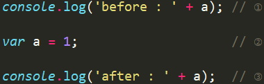
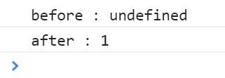

### JS 预编译
#### JS 特点
* 单线程 
* 解释型语言（解释一行，执行一行；不通篇编译为一个文件再执行）
#### JS执行过程
* 语法分析
* 预编译
* 解释执行
#### JS预编译
> 预编译，简单理解，就是在内存中开辟一块空间，用来存放变量和函数。预编译**发生在函数执行前**；也就是说函数执行时，预编译已经结束。

JavaScript 仅提升声明，而不提升初始化。
#####  变量声明提升
* 由于变量的声明总是在**任意代码执行之前**进行处理的，所以代码中任意位置声明变量总是**等效于在代码开头声明**；这意味着变量可以在声明之前进行使用，这个行为叫“hositing”,就像把所有的变量声明移动到函数或者全局代码的开头位置；
* 变量和函数声明在代码里的位置是不会动的，**编译阶段被放入内存中**。
##### 函数声明提升
* 函数声明语句将会被提升到外部脚本或者外部函数作用域的顶部。
* **函数和变量相比，会被优先提升。这意味着函数会被提升到更靠前的位置**。
* JavaScript 在执行任何代码段之前，将函数声明放入内存中的优点之一是，你可以在声明一个函数之前使用该函数。
``` javascript
bla = 2
var bla;
// ...

// 可以隐式地（implicitly）将以上代码理解为：

var bla;
bla = 2;

// ----------变量初始化-------------
// Example 1 - Does not hoist
var x = 1;                 // 声明 + 初始化 x
console.log(x + " " + y);  // '1 undefined'
var y = 2;    


// ----------函数声明提升-------------
hoisted(); // "foo"

function hoisted() {
     console.log("foo"); 
}


/* equal to*/
var hoisted; 

hoisted = function() {
  console.log("foo");
}
hoisted();
// "foo" 
```
##### 声明和未声明变量之间的差异
声明变量的作用域限制在其声明位置的上下文中，而**非声明变量总是全局的**
``` javascript
function x() {
  y = 1;   // 在严格模式（strict mode）下会抛出 ReferenceError 异常
  var z = 2;
}

x();

console.log(y); // 打印 "1"
console.log(z); // 抛出 ReferenceError: z 未在 x 外部声明
```
---



1.  JavaScript 脚本在执行之前先进行预编译，所以 ① 和 ③ 不会执行，而是先执行 ②，进行预编译；
2.   因为预编译阶段是不对变量进行赋值的，即不进行初始化，所以 ② 也只执行前半部分 var a ，由于只声明了变量，而没有进行赋值，所以此时变量的值为 undefined；
3.   预编译完毕之后，JavaScript 脚本开始执行，执行顺序按照从上到下的顺序执行。
