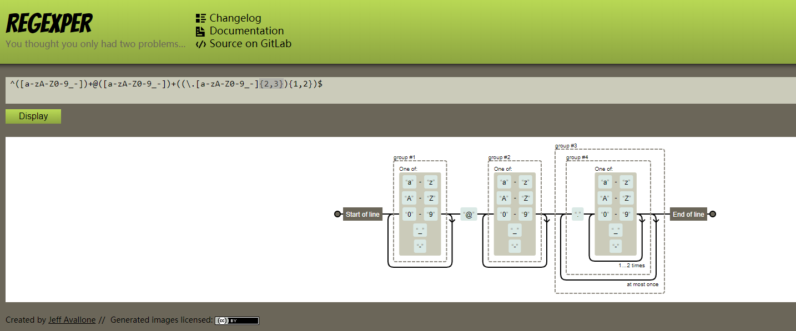
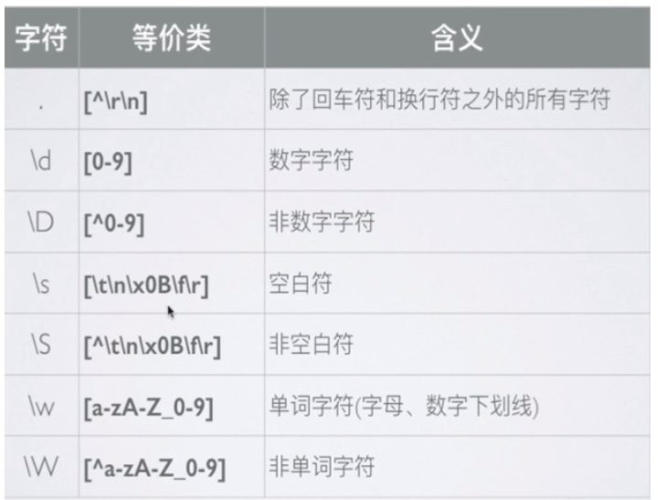
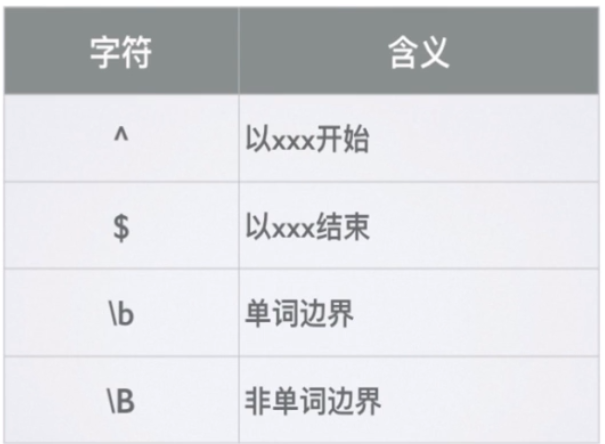
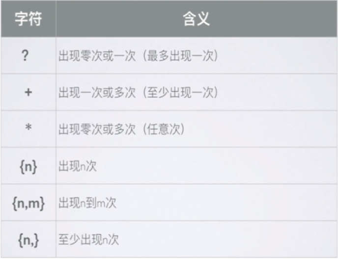
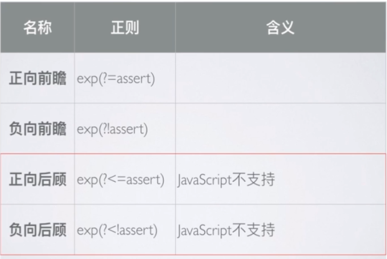

# 正则表达式
### 正则表达式处理场景
* IDE中使用正则表达式处理规则复杂的字符串查找或者替换需求
* JS使用正则表达式处理字符串

### 检测正则表达式工具
	
* 网址：https://regexper.com
* 例子展示：邮箱匹配
	

### 创建方式
* JS 通过内置对象RegExp支持正则表达式，创建正则表达式的两种方式：
	* 字面量
	* 构造函数
``` 
	var email = "zyxweb@163.com"
	var reg1 = /^([a-zA-Z0-9_-])+@([a-zA-Z0-9_-])+((\.[a-zA-Z0-9_-]{2,3}){1,2})$/
	var reg2 = new RegExp("^([a-zA-Z0-9_-])+@([a-zA-Z0-9_-])+((\\.[a-zA-Z0-9_-]{2,3}){1,2})$");
``` 

### 常见语法
* 修饰符
	* g 全部搜索，如果不加，则只匹配第一个截止
	* i  不区分大小写
	* m 多行搜索

``` 
	var name = "zhaoyu Yu xing";
	var reg = /\byu\b/i;
	console.log(name.replace(reg,"yu")) // "zhaoyu yu xing"
```
	
* () 用来分组，可以用$ + 数字，获取()匹配到的字符串。如果想忽略分组，则需要加上?:就可以了。

``` 
    var str = "2019-10-02"; // 要替换成 02/10/2019
    var reg6 = /(\d{4})-(\d{2})-(\d{2})/g;
    console.log(str.match(reg6)) // [2019-10-02]
    console.log(str.replace(reg6,"$3/$2/$1")) // 02/10/2019
```

* | 表示或
``` 
    var str = "zhaoyuxingyuxing";
    var reg5 = /zhao|yuxing/g;
    console.log(str.match(reg5)) //  ["zhao", "yuxing", "yuxing"]
    console.log(str.replace(reg5,"X")) // XXX
```
* [] 表示任意一个。[abc]表示a,b,c中任意一个
* ^ 在表达式[]中间，则表示非。例如[^abc] 表示非abc任意一个。
* 贪婪模式匹配，尽可能多的匹配
``` 
    var num = "12345678";
    var reg1 = /\d{3,6}/g;
    console.log(num.replace(reg1,"X")) // X78
```

* 非贪婪模式匹配，尽可能少匹配，需加?
``` 
    var num = "12345678";
    var reg2 = /\d{3,6}?/g;
    console.log(num.match(reg3)) // [123,456]
    console.log(num.replace(reg2,"X")) // XX78
```





``` 
    var str = "a1bb*34c";
    var reg8 = /\w(?=\d)/g;
    console.log(str.match(reg8)); // ["a", "3"]
    console.log(str.replace(reg8,"X")) // X1bb*X4c
``` 

``` 
    var str = "a1bb*34c";
    var reg9 = /\w(?!\d)/g;
    console.log(str.match(reg9)); // ["1", "b", "b", "4", "c"]
    console.log(str.replace(reg9,"X")) // aXXX*3XX
``` 
### 常见方法
* test()：用于测试字符串参数中是否存在正则表达式模式字符串，返回值：true or false;多次全局匹配时，结果可能不一样原因是:匹配是根据lastIndex为开始位置进行匹配
``` 
    var str = "ab";
    var reg = /\w/g;
    console.log(reg.lastIndex,reg.test(str)); // 0 true
    console.log(reg.lastIndex,reg.test(str)); // 1 true
    console.log(reg.lastIndex,reg.test(str)); // 2 false
    console.log(reg.lastIndex,reg.test(str)); // 0 true
```
* exec(): 使用正则表达式对字符串执行搜索，并将更新全局RegExp对象的属性以反映匹配结果，没有匹配返回null，否则返回一个数组，两个属性：
	* index:声明匹配文本第一个字符的位置
	* input: 存放被检索的字符串string
* 非全局匹配返回数组：
	* 第一个元素：与正则表达式匹配的文本
	* 第二个元素：第一个子表达式相匹配的文本（如果有的话）
	* 第二个元素：第二个子表达式相匹配的文本（如果有的话）
```
    var str = "@1az2bb3cy4dd5ee";
    var reg1 = /\d(\w)(\w)\d/;
    var reg2 = /\d(\w)(\w)\d/g;

    var ret1 = reg1.exec(str);

    console.log(reg1.lastIndex + " " + ret1.index + " " + ret1.input + " " + ret1); 
    // 0 1 @1az2bb3cy4dd5ee 1az2,a,z
    console.log(reg1.lastIndex + " " + ret1.index + " " + ret1.input + " " + ret1); 
    // 0 1 @1az2bb3cy4dd5ee 1az2,a,z
    var ret2;
    while (ret2 = reg2.exec(str)) {
        console.log(reg2.lastIndex + " " + ret2.index + " " + ret2.input +" " + ret2);
    }
    // 5 1 @1az2bb3cy4dd5ee 1az2,a,z
    // 11 7 @1az2bb3cy4dd5ee 3cy4,c,y
```
### 字符串可以使用正则方法
* search(reg):方法返回第一个匹配结果index,查不到返回-1。注意：会忽略全局匹配，即g标志，总是从字符串的开始进行搜索。
```
    console.log("abc1b1c2d1".search('1')); // 3
    console.log("abc1b1c2d1".search('4')); // -1
    // 传数字1 将会转化为/1/正则
    console.log("abc1b1c2d1".search(1)); // 3
    console.log("abc1b1c2d1".search(/1/)); // 3
    console.log("abc1b1c2d1".search(/1/g)); // 3
```
* match():检索字符串，找到一个或者多个与正则匹配的字符串文本。
	* 非全局调用：如何没有匹配上，则返回null，否则返回数组，数组中存在它匹配文本有关信息：
		* 数组存放元素：
			*	第一个元素：与正则表达式匹配的文本
			*  第二个元素：第一个子表达式相匹配的文本（如果有的话）
			*  第二个元素：第二个子表达式相匹配的文本（如果有的话） 
		* 额外属性：
			* index:声明匹配文本第一个字符的位置
			* input: 存放被检索的字符串string
	
``` 
 console.log("abc1b1c2d1".match(/\d(\w)\d/));
 // (2) ["1b1", "b", index: 3, input: "abc1b1c2d1", groups: undefined]
 console.log("abc1b1c2d1".match(/\d(\w)\d/g)); 
 // (2) ["1b1", "2d1"]
```

* split():将字符串分割为数组

``` 
 console.log("abc1b1c2d1".split(/\d/g));
 // (5) ["abc", "b", "c", "d", ""]
``` 

* replace():有三种写法
	*  replace(str,replaceStr) 
	*  replace(reg,replaceStr) 
	*   replace(reg,function): function 会在每次匹配时调用，有四个参数
		* 匹配的字符串
		* 正则表达式分组内容，没有分组则没有
		* 匹配项在字符串中index
		* 原字符串  

``` 
    // '1'会自动转化为正则表达式 /1/
    console.log("abc1b1c2d1".replace('1','7')); // abc7b1c2d1
    // 数字1会自动转化为正则表达式 /1/
    console.log("abc1b1c2d1".replace(1,'7')); // abc7b1c2d1
    console.log("abc1b1c2d1".replace(/1/,'7')); // abc7b1c2d1
    console.log("abc1b1c2d1".replace(/1/g,'7')); // abc7b7c2d7
    console.log("abc1b1c2d1".replace(/\d/g,function (match,index,originStr) {
        console.log(index);
        return parseInt(match)+1;
    }));
    // 3
    // 5
    // 7
    // 9
    // abc2b2c3d2
```