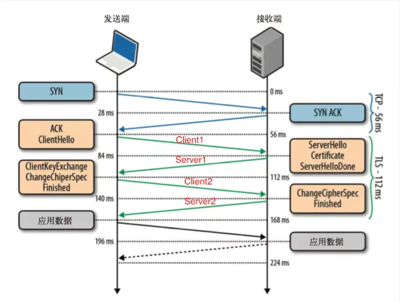

### HTTPS 握手过程
#### HTTPS握手过程：

* 首先，客户端发起握手请求，以明文传输请求信息，包含版本信息，加密-套件候选列表，压缩算法候选列表，随机数，扩展字段等信息(这个没什么好说的，就是用户在浏览器里输入一个HTTPS网址，然后连接到服务端的443端口。)
* 服务端的配置，采用HTTPS协议的服务器必须要有一套数字证书，可以自己制作，也可以向组织申请。区别就是自己颁发的证书需要客户端验证通过，才可以继续访问，而使用受信任的公司申请的证书则不会弹出提示页面。这套证书其实就是一对公钥和私钥。如果对公钥不太理解，可以想象成一把钥匙和一个锁头，只是世界上只有你一个人有这把钥匙，你可以把锁头给别人，别人可以用这个锁把重要的东西锁起来，然后发给你，因为只有你一个人有这把钥匙，所以只有你才能看到被这把锁锁起来的东西。
* 服务端返回协商的信息结果，包括选择使用的协议版本 version，选择的加密套件 cipher suite，选择的压缩算法 compression method、随机数 random_S 以及证书。(这个证书其实就是公钥，只是包含了很多信息，如证书的颁发机构，过期时间等等。)
* 客户端验证证书的合法性，包括可信性，是否吊销，过期时间和域名。(这部分工作是由客户端的SSL/TLS来完成的，首先会验证公钥是否有效，比如颁发机构，过期时间等等，如果发现异常，则会弹出一个警示框，提示证书存在的问题。如果证书没有问题，那么就生成一个随机值。然后用证书（也就是公钥）对这个随机值进行加密。就好像上面说的，把随机值用锁头锁起来，这样除非有钥匙，不然看不到被锁住的内容。)
* 客户端使用公匙对对称密匙加密，发送给服务端。(这部分传送的是用证书加密后的随机值，目的是让服务端得到这个随机值，以后客户端和服务端的通信就可以通过这个随机值来进行加密解密了。)
* 服务器用私钥解密，拿到对称加密的密匙。(服务端用私钥解密后，得到了客户端传过来的随机值，然后把内容通过该随机值进行对称加密，将信息和私钥通过某种算法混合在一起，这样除非知道私钥，不然无法获取内容，而正好客户端和服务端都知道这个私钥，所以只要加密算法够彪悍，私钥够复杂，数据就够安全。)
* 传输加密后的信息，这部分信息就是服务端用私钥加密后的信息，可以在客户端用随机值解密还原。
* 客户端解密信息，客户端用之前生产的私钥解密服务端传过来的信息，于是获取了解密后的内容。整个过程第三方即使监听到了数据，也束手无策。
#### 客户端和服务端之间的加密机制：

TLS协议是基于TCP协议之上的，图中第一个蓝色往返是TCP的握手过程，之后两次橙色的往返，我们可以叫做TLS的握手。握手过程如下：

* client1：TLS版本号+所支持加密套件列表+希望使用的TLS选项

* Server1:选择一个客户端的加密套件+自己的公钥+自己的证书+希望使用的TLS选项+（要求客户端证书）；

* Client2:(自己的证书)+使用服务器公钥和协商的加密套件加密一个对称秘钥（自己生成的一个随机值）；

* Server2:使用私钥解密出对称秘钥（随机值）后，发送加密的Finish消息，表明完成握手

摘自链接：https://www.jianshu.com/p/e30a8c4fa329
