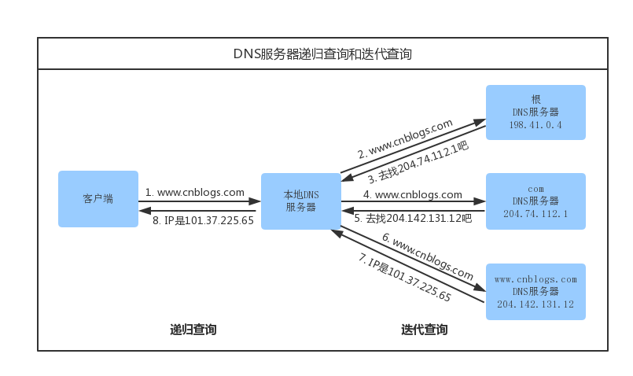
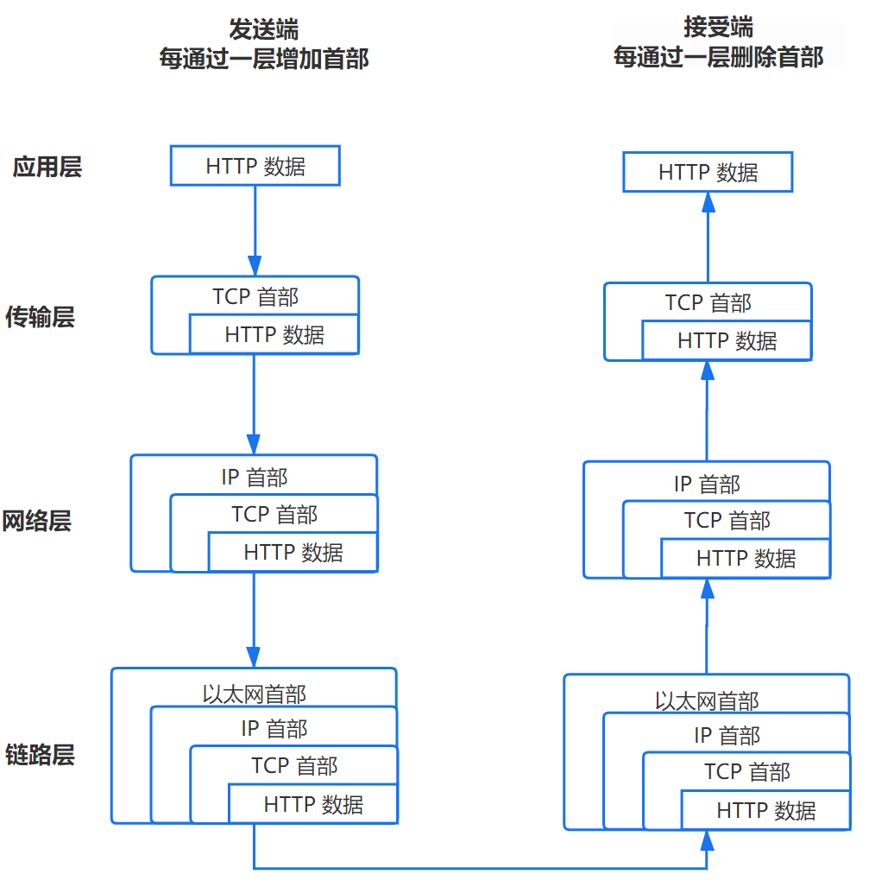
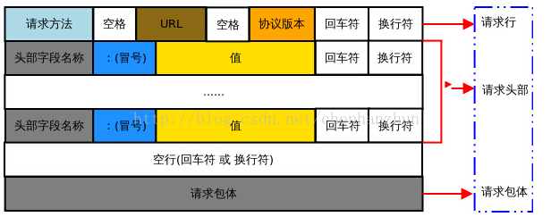
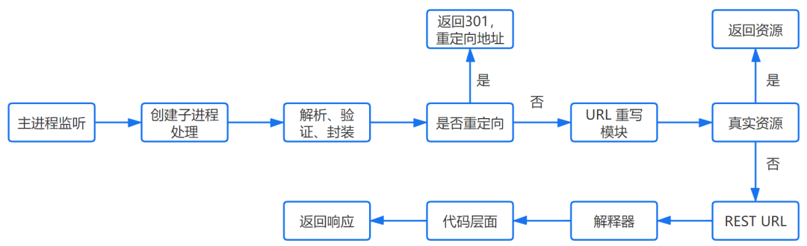
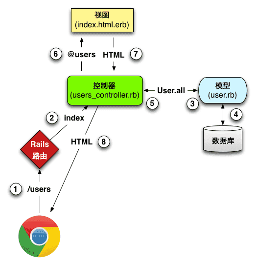
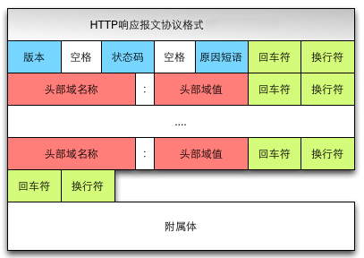
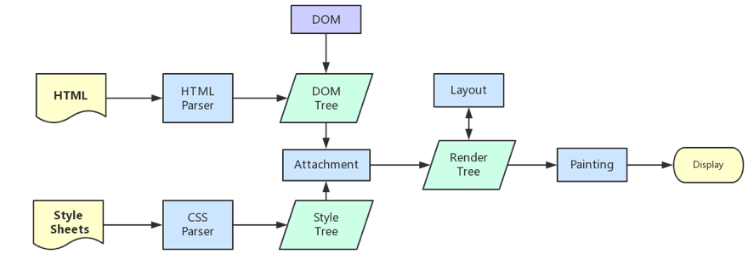
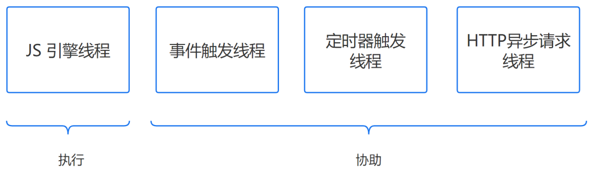

# 从URL输入到页面展现到底发生什么？
## 大致流程
* URL 解析
* DNS 查询
* TCP 连接
* 处理请求
* 接受响应
* 渲染页面

### URL解析
**地址解析：**
 首先判断你输入的是一个合法的 URL 还是一个待搜索的关键词，并且根据你输入的内容进行自动完成、字符编码等操作。
**HSTS**
由于安全隐患，会使用 HSTS 强制客户端使用 HTTPS 访问页面。
**其他操作**
浏览器还会进行一些额外的操作，比如安全检查、访问限制（之前国产浏览器限制 996.icu）。
**检查缓存**

### DNS 解析:将域名解析成 IP 地址

浏览器通过向 DNS 服务器发送域名，DNS 服务器查询到与域名相对应的 IP 地址，然后返回给浏览器，浏览器再将 IP 地址打在协议上，同时请求参数也会在协议搭载，然后一并发送给对应的服务器。接下来介绍向服务器发送 HTTP 请求阶段。

#### 浏览器如何通过域名去查询 URL 对应的 IP 呢
* 浏览器缓存：浏览器会按照一定的频率缓存 DNS 记录。浏览器会先检查是否在缓存中，没有则调用系统库函数进行查询。
*  操作系统缓存：如果浏览器缓存中找不到需要的 DNS 记录，那就去操作系统中找。操作系统也有自己的 DNS缓存，但在这之前，会向检查域名是否存在本地的 Hosts 文件里，没有则向 DNS 服务器发送查询请求。
*  路由缓存：路由器也有 DNS 缓存。
*  ISP 的 DNS 服务器：ISP 是互联网服务提供商(Internet Service Provider)的简称，ISP 有专门的 DNS 服务器应对 DNS 查询请求。
* 根服务器：ISP 的 DNS 服务器还找不到的话，它就会向根服务器发出请求，进行递归查询（DNS 服务器先问根域名服务器.com 域名服务器的 IP 地址，然后再问.baidu 域名服务器，依次类推）

**需要注意的点**
* 递归方式：一路查下去中间不返回，得到最终结果才返回信息（浏览器到本地DNS服务器的过程）
* 迭代方式，就是本地DNS服务器到根域名服务器查询的方式。
* 什么是 DNS 劫持
* 前端 dns-prefetch 优化

### TCP 连接：TCP 三次握手

“三次握手”的目的是“为了防止已失效的连接请求报文段突然又传送到了服务端，因而产生错误”。

#### 1.  应用层：发送 HTTP 请求
在前面的步骤我们已经得到服务器的 IP 地址，浏览器会开始构造一个 HTTP 报文，其中包括：
* 请求报头（Request Header）：请求方法、目标地址、遵循的协议等等
* 请求主体（其他参数）
其中需要注意的点：
* 请求报文由请求行（request line）、请求头（header）、请求体三个部分组成,如下图所示：
	* 请求行包含请求方法、URL、协议版本
	* 请求方法包含 8 种：GET、POST、PUT、DELETE、PATCH、HEAD、OPTIONS、TRACE。
	* URL 即请求地址，由 <协议>：//<主机>：<端口>/<路径>?<参数> 组成
	* 协议版本即 http 版本号
举个栗子：POST  /chapter17/user.html HTTP/1.1
* 请求头包含请求的附加信息，由关键字/值对组成，每行一对，关键字和值用英文冒号“:”分隔。
请求头部通知服务器有关于客户端请求的信息。它包含许多有关的客户端环境和请求正文的有用信息。其中比如：Host，表示主机名，虚拟主机；Connection,HTTP/1.1 增加的，使用 keepalive，即持久连接，一个连接可以发多个请求；User-Agent，请求发出者，兼容性以及定制化需求。
* 请求体，可以承载多个请求参数的数据，包含回车符、换行符和请求数据，并不是所有请求都具有请求数据。
举个栗子：name=tom&password=1234&realName=tomson

#### 2. 传输层：TCP 传输报文
传输层会发起一条到达服务器的 TCP 连接，为了方便传输，会对数据进行分割（以报文段为单位），并标记编号，方便服务器接受时能够准确地还原报文信息。
在建立连接前，会先进行 TCP 三次握手。

#### 3.  网络层：IP协议查询Mac地址
将数据段打包，并加入源及目标的IP地址，并且负责寻找传输路线。
判断目标地址是否与当前地址处于同一网络中，是的话直接根据 Mac 地址发送，否则使用路由表查找下一跳地址，以及使用 ARP 协议查询它的 Mac 地址。
> 注意：在 OSI 参考模型中 ARP 协议位于链路层，但在 TCP/IP 中，它位于网络层。

#### 4. 链路层：以太网协议
根据以太网协议将数据分为以“帧”为单位的数据包，每一帧分为两个部分：
* 标头：数据包的发送者、接受者、数据类型
* 数据：数据包具体内容
**Mac 地址**
以太网规定了连入网络的所有设备都必须具备“网卡”接口，数据包都是从一块网卡传递到另一块网卡，网卡的地址就是 Mac 地址。每一个 Mac 地址都是独一无二的，具备了一对一的能力。
**广播**
发送数据的方法很原始，直接把数据通过 ARP 协议，向本网络的所有机器发送，接收方根据标头信息与自身 Mac 地址比较，一致就接受，否则丢弃。
注意：接收方回应是单播。

### 服务器接受请求
接受过程就是把以上步骤逆转过来，参见上图。

服务器处理请求并返回 HTTP 报文

#### HTTPD
最常见的 HTTPD 有 Linux 上常用的 Apache 和 Nginx，以及 Windows 上的 IIS。
它会监听得到的请求，然后开启一个子进程去处理这个请求。
#### 处理请求
接受 TCP 报文后，会对连接进行处理，对HTTP协议进行解析（请求方法、域名、路径等），并且进行一些验证：
验证是否配置虚拟主机
验证虚拟主机是否接受此方法
验证该用户可以使用该方法（根据 IP 地址、身份信息等）
#### 重定向
假如服务器配置了 HTTP 重定向，就会返回一个 301永久重定向响应，浏览器就会根据响应，重新发送 HTTP 请求（重新执行上面的过程）。
#### URL 重写
然后会查看 URL 重写规则，如果请求的文件是真实存在的，比如图片、html、css、js文件等，则会直接把这个文件返回。
否则服务器会按照规则把请求重写到 一个 REST 风格的 URL 上。
然后根据动态语言的脚本，来决定调用什么类型的动态文件解释器来处理这个请求。
##### 举例
以 PHP 语言的 MVC 框架举例，它首先会初始化一些环境的参数，根据 URL 由上到下地去匹配路由，然后让路由所定义的方法去处理请求。

后台开发现在有很多框架，但大部分都还是按照 MVC 设计模式进行搭建的。
MVC 是一个设计模式，将应用程序分成三个核心部件：模型（model）-- 视图（view）--控制器（controller），它们各自处理自己的任务，实现输入、处理和输出的分离。
1、视图（view）
它是提供给用户的操作界面，是程序的外壳。
2、模型（model）
模型主要负责数据交互。在 MVC 的三个部件中，模型拥有最多的处理任务。一个模型能为多个视图提供数据。
3、控制器（controller）
它负责根据用户从"视图层"输入的指令，选取"模型层"中的数据，然后对其进行相应的操作，产生最终结果。控制器属于管理者角色，从视图接收请求并决定调用哪个模型构件去处理请求，然后再确定用哪个视图来显示模型处理返回的数据。
这三层是紧密联系在一起的，但又是互相独立的，每一层内部的变化不影响其他层。每一层都对外提供接口（Interface），供上面一层调用。
至于这一阶段发生什么？简而言之，首先浏览器发送过来的请求先经过控制器，控制器进行逻辑处理和请求分发，接着会调用模型，这一阶段模型会获取 redis db 以及 MySQL 的数据，获取数据后将渲染好的页面，响应信息会以响应报文的形式返回给客户端，最后浏览器通过渲染引擎将网页呈现在用户面前。

响应报文由响应行（request line）、响应头部（header）、响应主体三个部分组成。如下图所示：
(1) 响应行包含：协议版本，状态码，状态码描述
状态码规则如下：
1xx：指示信息--表示请求已接收，继续处理。
2xx：成功--表示请求已被成功接收、理解、接受。
3xx：重定向--要完成请求必须进行更进一步的操作。
4xx：客户端错误--请求有语法错误或请求无法实现。
5xx：服务器端错误--服务器未能实现合法的请求。
(2) 响应头部包含响应报文的附加信息，由 名/值 对组成
(3) 响应主体包含回车符、换行符和响应返回数据，并不是所有响应报文都有响应数据

### 浏览器接受响应
浏览器接收到来自服务器的响应资源后，会对资源进行分析。
首先查看 Response header，根据不同状态码做不同的事（比如上面提到的重定向）。
如果响应资源进行了压缩（比如 gzip），还需要进行解压。
然后，对响应资源做缓存。
接下来，根据响应资源里的 MIME[3] 类型去解析响应内容（比如 HTML、Image各有不同的解析方式）。

### 断开连接：TCP 四次挥手
当数据传送完毕，需要断开 tcp 连接，此时发起 tcp 四次挥手。

发起方向被动方发送报文，Fin、Ack、Seq，表示已经没有数据传输了。并进入 FIN_WAIT_1 状态。(第一次挥手：由浏览器发起的，发送给服务器，我请求报文发送完了，你准备关闭吧)
被动方发送报文，Ack、Seq，表示同意关闭请求。此时主机发起方进入 FIN_WAIT_2 状态。(第二次挥手：由服务器发起的，告诉浏览器，我请求报文接受完了，我准备关闭了，你也准备吧)
被动方向发起方发送报文段，Fin、Ack、Seq，请求关闭连接。并进入 LAST_ACK 状态。(第三次挥手：由服务器发起，告诉浏览器，我响应报文发送完了，你准备关闭吧)
发起方向被动方发送报文段，Ack、Seq。然后进入等待 TIME_WAIT 状态。被动方收到发起方的报文段以后关闭连接。发起方等待一定时间未收到回复，则正常关闭。(第四次挥手：由浏览器发起，告诉服务器，我响应报文接受完了，我准备关闭了，你也准备吧)

### 浏览器解析渲染页面

浏览器解析渲染页面分为一下五个步骤：
* 根据 HTML 解析出 DOM 树
* 根据 CSS 解析生成 CSS 规则树
* 结合 DOM 树和 CSS 规则树，生成渲染树
* 根据渲染树计算每一个节点的信息
* 根据计算好的信息绘制页面

#### 1.根据 HTML 解析 DOM 树
根据 HTML 的内容，将标签按照结构解析成为 DOM 树，DOM 树解析的过程是一个深度优先遍历。即先构建当前节点的所有子节点，再构建下一个兄弟节点。
在读取 HTML 文档，构建 DOM 树的过程中，若遇到 script 标签，则 DOM 树的构建会暂停，直至脚本执行完毕。

首先要知道浏览器解析是从上往下一行一行地解析的。
解析的过程可以分为四个步骤：
① 解码（encoding）
传输回来的其实都是一些二进制字节数据，浏览器需要根据文件指定编码（例如UTF-8）转换成字符串，也就是HTML 代码。
② 预解析（pre-parsing）
预解析做的事情是提前加载资源，减少处理时间，它会识别一些会请求资源的属性，比如img标签的src属性，并将这个请求加到请求队列中。
③ 符号化（Tokenization）
符号化是词法分析的过程，将输入解析成符号，HTML 符号包括，开始标签、结束标签、属性名和属性值。
它通过一个状态机去识别符号的状态，比如遇到<，>状态都会产生变化。
④ 构建树（tree construction）

注意：符号化和构建树是并行操作的，也就是说只要解析到一个开始标签，就会创建一个 DOM 节点。

浏览器容错进制
你从来没有在浏览器看过类似”语法无效”的错误，这是因为浏览器去纠正错误的语法，然后继续工作。
事件
当整个解析的过程完成以后，浏览器会通过DOMContentLoaded事件来通知DOM解析完成。

#### 2.根据 CSS 解析生成 CSS 规则树
解析 CSS 规则树时 js 执行将暂停，直至 CSS 规则树就绪。
浏览器在 CSS 规则树生成之前不会进行渲染。
CSS 匹配规则:
在匹配一个节点对应的 CSS 规则时，是按照从右到左的顺序的，例如：div p { font-size :14px }会先寻找所有的p标签然后判断它的父元素是否为div。
#### 3.结合 DOM 树和 CSS 规则树，生成渲染树
DOM 树和 CSS 规则树全部准备好了以后，浏览器才会开始构建渲染树。其实这就是一个 DOM 树和 CSS 规则树合并的过程。
精简 CSS 并可以加快 CSS 规则树的构建，从而加快页面相应速度。

> 注意：渲染树会忽略那些不需要渲染的节点，比如设置了display:none的节点。

**计算**
通过计算让任何尺寸值都减少到三个可能之一：auto、百分比、px，比如把rem转化为px。
**级联**
浏览器需要一种方法来确定哪些样式才真正需要应用到对应元素，所以它使用一个叫做specificity的公式，这个公式会通过：
标签名、class、id, 是否内联样式, !important 然后得出一个权重值，取最高的那个。
**渲染阻塞**
当遇到一个script标签时，DOM 构建会被暂停，直至脚本完成执行，然后继续构建 DOM 树。
但如果 JS 依赖 CSS 样式，而它还没有被下载和构建时，浏览器就会延迟脚本执行，直至 CSS Rules 被构建。
我们知道：
CSS 会阻塞 JS 执行
JS 会阻塞后面的 DOM 解析
为了避免这种情况，应该以下原则：
CSS 资源排在 JavaScript 资源前面
JS 放在 HTML 最底部，也就是` </body>`前
另外，如果要改变阻塞模式，可以使用 defer 与 async

#### 4.根据渲染树计算每一个节点的信息（布局）
布局：通过渲染树中渲染对象的信息，计算出每一个渲染对象的位置和尺寸
回流：在布局完成后，发现了某个部分发生了变化影响了布局，那就需要倒回去重新渲染。
#### 5.根据计算好的信息绘制页面
绘制阶段，系统会遍历呈现树，并调用呈现器的“paint”方法，将呈现器的内容显示在屏幕上。
重绘：某个元素的背景颜色，文字颜色等，不影响元素周围或内部布局的属性，将只会引起浏览器的重绘。
回流：某个元素的尺寸发生了变化，则需重新计算渲染树，重新渲染。
比如：`display:none `会触发回流，而 `visibility:hidden `只会触发重绘。

#### 6.JavaScript 编译执行
大致流程可以分为三个阶段：
##### 1. 词法分析
JS 脚本加载完毕后，会首先进入语法分析阶段，它首先会分析代码块的语法是否正确，不正确则抛出“语法错误”，停止执行。
几个步骤：
* 分词，例如将var a = 2，，分成var、a、=、2这样的词法单元。
* 解析，将词法单元转换成抽象语法树（AST）。
* 代码生成，将抽象语法树转换成机器指令。
##### 2. 预编译
JS 有三种运行环境：
* 全局环境
* 函数环境
* eval
每进入一个不同的运行环境都会创建一个对应的执行上下文，根据不同的上下文环境，形成一个函数调用栈，栈底永远是全局执行上下文，栈顶则永远是当前执行上下文。
创建执行上下文
创建执行上下文的过程中，主要做了以下三件事：
	* 创建变量对象
	* 参数、函数、变量
	* 建立作用域链
	* 确认当前执行环境是否能访问变量
	* 确定 This 指向
##### 3. 执行
**JS 线程**

虽然 JS 是单线程的，但实际上参与工作的线程一共有四个：(其中三个只是协助，只有 JS 引擎线程是真正执行的)

* JS 引擎线程：也叫 JS 内核，负责解析执行 JS 脚本程序的主线程，例如 V8 引擎
* 事件触发线程：属于浏览器内核线程，主要用于控制事件，例如鼠标、键盘等，当事件被触发时，就会把事件的处理函数推进事件队列，等待 JS 引擎线程执行
* 定时器触发线程：主要控制setInterval和setTimeout，用来计时，计时完毕后，则把定时器的处理函数推进事件队列中，等待 JS 引擎线程。
* HTTP 异步请求线程：通过XMLHttpRequest连接后，通过浏览器新开的一个线程，监控readyState状态变更时，如果设置了该状态的回调函数，则将该状态的处理函数推进事件队列中，等待JS引擎线程执行。
> 注：浏览器对同一域名的并发连接数是有限的，通常为 6 个。

**宏任务**
分为：
* 同步任务：按照顺序执行，只有前一个任务完成后，才能执行后一个任务
* 异步任务：不直接执行，只有满足触发条件时，相关的线程将该异步任务推进任务队列中，等待JS引擎主线程上的任务执行完毕时才开始执行，例如异步Ajax、DOM事件，setTimeout等。

**微任务**
微任务是ES6和Node环境下的，主要 API 有：Promise，process.nextTick。
微任务的执行在宏任务的同步任务之后，在异步任务之前。

